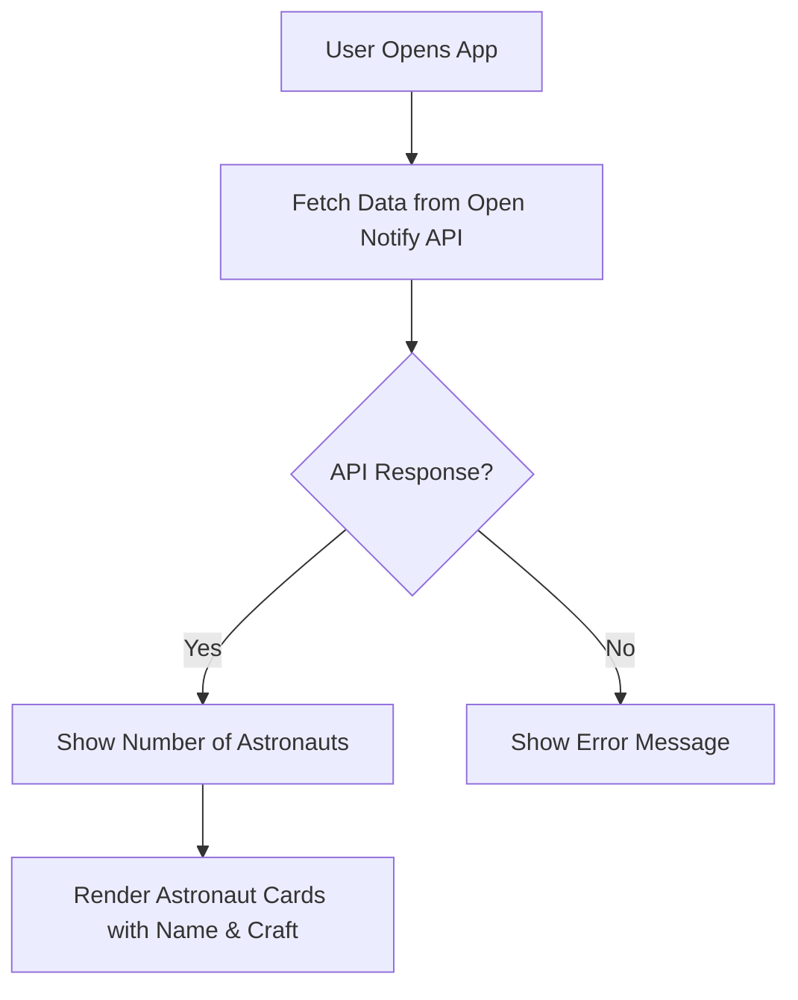

# 🌌 Space Stalker  

Space Stalker is a **real-time space tracking app** that lets you peek into humanity’s greatest adventure — **life in orbit**.  
It uses the **Open Notify API** to instantly show:  
- How many astronauts are currently in space 🧑‍🚀  
- Who they are and which spacecraft they’re on 🚀  

With a **glassmorphism-inspired UI** and smooth **GSAP animations**, Space Stalker turns raw space data into a **cosmic story unfolding above us**.  

---

## ✨ Features  
- 🔭 Fetches **real-time astronaut data** from [Open Notify API](http://api.open-notify.org/astros.json).  
- 👨‍🚀 Displays astronaut **names** and their **spacecraft**.  
- 🌌 Shows **number of people currently in space** in a stylish counter.  
- 🎨 Modern **UI with glassmorphism + neon glow effects**.  
- 🎞️ Smooth **GSAP animations** for interactive feel.  

---

## 🖥️ Tech Stack  
- **HTML5** – Structure  
- **CSS3** (Glassmorphism + Animations) – Styling  
- **JavaScript (ES6+)** – Logic & API Integration  
- **GSAP** – Animations  
- **Open Notify API** – Astronaut Data  

---

## 📸 Screenshots  
### Landing Page  
  

### Astronaut Info Cards  
  

---

## ⚡ How It Works  



---

## 🚀 Getting Started  

1. Clone this repository:  
   ```bash
   git clone https://github.com/yourusername/space-stalker.git
   cd space-stalker
   ```
2. Open `index.html` in your browser.  
3. Watch astronauts in **real-time** ✨  

---

## 🌍 API Reference  
**Open Notify Astronaut API**  
Endpoint:  
```
http://api.open-notify.org/astros.json
```

Response Example:
```json
{
  "number": 10,
  "people": [
    { "craft": "ISS", "name": "Astronaut 1" },
    { "craft": "ISS", "name": "Astronaut 2" }
  ],
  "message": "success"
}
```

---

## 🎯 Future Enhancements  
- 🛰️ Add **live ISS location tracking (latitude/longitude map)**.  
- 🔔 Add astronaut **notifications when crew changes**.  
- 🌐 Multi-language support.  

---

## 🌐 Real-World Analogy  
Think of **Space Stalker** like following a **live sports match**:  
- 🧑‍🚀 Astronauts = **Players**  
- 🚀 Spacecraft = **Stadiums**  
- 🌌 The sky = **The whole tournament**  

Just as you check who’s on the field and where they’re playing, Space Stalker tells you who’s in space and which spacecraft they’re aboard — **all in real time**.  

---

## 👨‍💻 Author  
Built with ❤️ by **[Your Name]**  
